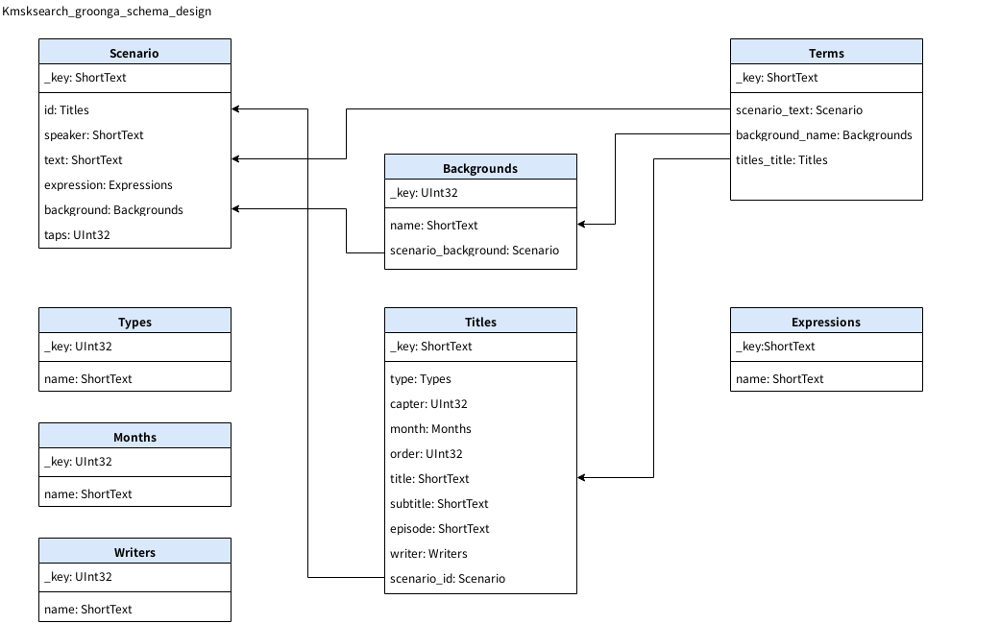

# Groongaスキーマデザイン

## 全体イメージ

---

## 詳細

### Writers : ライターテーブル

|Column|Type|Flags|Option|Description|
|:--|:--|:--|:--|:--|
|_key|UInt32|TABLE_HASH_KEY||ライターID|
|name|ShortText|||ライター名|

### Types : ストーリータイプテーブル

|Column|Type|Flags|Option|Description|
|:--|:--|:--|:--|:--|
|_key|UInt32|TABLE_HASH_KEY||ストーリータイプID|
|name|ShortText|||タイプ名|

### Months : 月テーブル

|Column|Type|Flags|Option|Description|
|:--|:--|:--|:--|:--|
|_key|UInt32|TABLE_HASH_KEY||月ID|
|name|ShortText|||月名|

### Backgrounds : 背景テーブル

|Column|Type|Flags|Option|Description|
|:--|:--|:--|:--|:--|
|_key|UInt32|TABLE_HASH_KEY||背景ID|
|name|ShortText|||背景名|
|scenario_background|Scenario*|COLUMN_INDEX|--source background|追加インデックス|

### Expressions : 表現テーブル

|Column|Type|Flags|Option|Description|
|:--|:--|:--|:--|:--|
|_key|ShortText|TABLE_HASH_KEY||表現名(en)|
|name|ShortText|||表現名(jp)(集約)|

### Scenario : シナリオテーブル

|Column|Type|Flags|Option|Description|
|:--|:--|:--|:--|:--|
|_key|ShortText|TABLE_HASH_KEY||id:taps|
|id|Titles*|COLUMN_SCALAR||ストーリーID|
|speaker|ShortText|||話し手
|text|ShortText|||内容
|expression|Expressions|||表現(感情)|
|background|Backgrounds*|COLUMN_SCALAR||背景番号|
|taps|UInt32|||タップ回数(推定)

### Titles : タイトルテーブル

|Column|Type|Flags|Option|Description|
|:--|:--|:--|:--|:--|
|_key|ShortText|TABLE_HASH_KEY||ストーリーID|
|type|Types*|COLUMN_SCALAR||ストーリータイプ|
|capter|UInt32|||チャプターID|
|month|Months*|COLUMN_SCALAR||月|
|order|UInt32|||チャプター内順番|
|title|ShortText|||タイトル|
|subtitle|ShortText|||サブタイトル|
|episode|ShortText|||エピソード|
|writer|Writers*|COLUMN_SCALAR||ライター|
|scenario_id|Scenario*|COLUMN_INDEX|--source id|追加インデックス|

### Terms : 語彙テーブル

|Column|Type|Flags|Option|Description|
|:--|:--|:--|:--|:--|
|_key|ShortText|TABLE_PAT_KEY|--default_tokenizer **TokenUnigram** --normalizer NormalizerAuto|求めてたのは単純なテキストマッチだった(トークナイザーとか高性能過ぎた…)|
|scenario_text|Scenario*|COLUMN_INDEX&#124;WITH_POSITION|--source text|使用|
|backgrounds_key|Backgrounds*|COLUMN_INDEX&#124;WITH_POSITION|--source background|用意したけど都合により未使用|
|title_key|Titles*|COLUMN_INDEX&#124;WITH_POSITION|--source _key|用意したけど都合により未使用|
